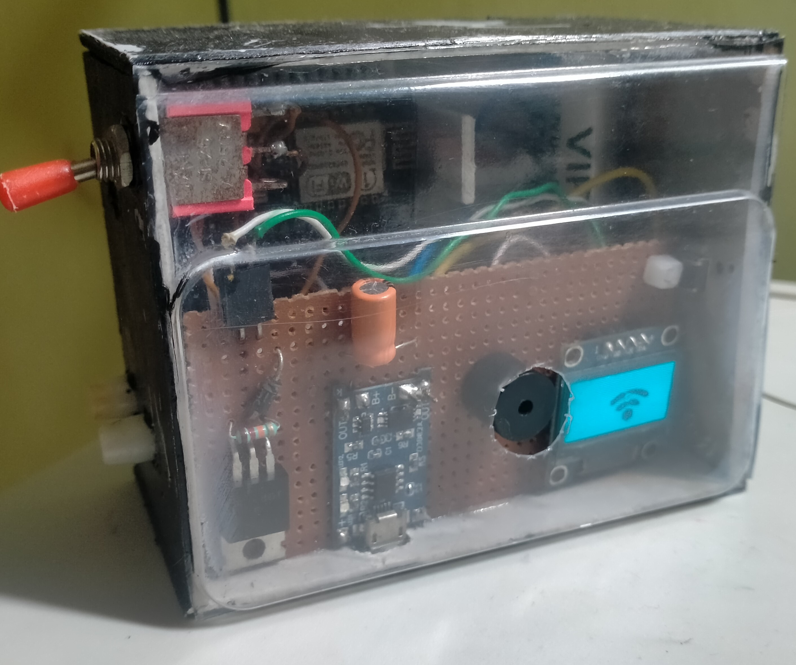
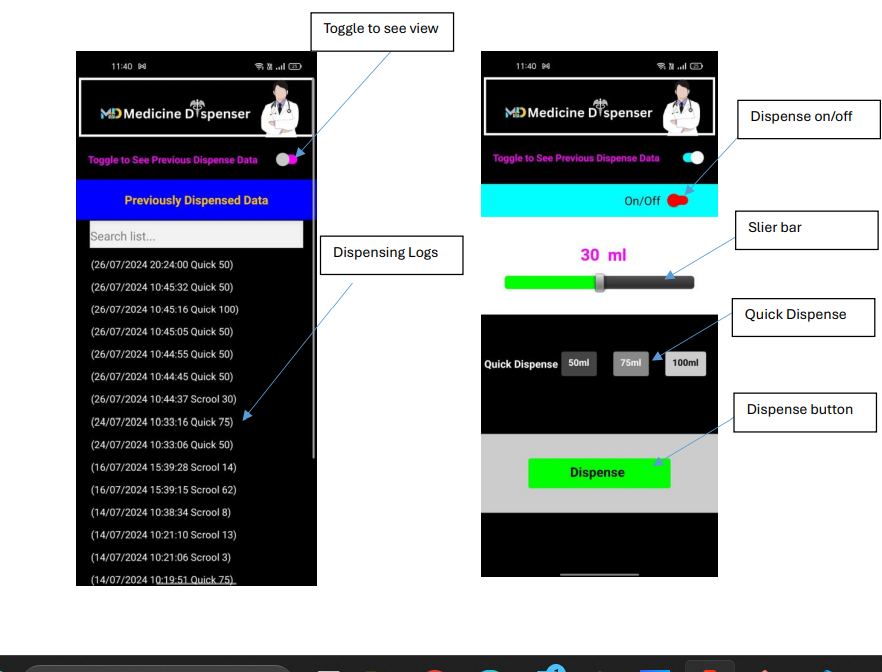

# IoT-Based Automated Medicine Dispensing System Using Node MCU

## Introduction

The IoT-based Automated Medicine Dispensing System is designed to revolutionize the way medication is administered, ensuring accuracy and efficiency in patient care. This system integrates modern technology to facilitate precise delivery of medication, significantly reducing the potential for human error.

## Features

- **Accurate Medication Dispensing**: Ensures precise delivery of medication as per the prescribed dosage.
- **Real-time Data Logging**: Logs each dispensation event, including date, time, and amount, into a Google Sheet.
- **Historical Data Access**: Allows users to view historical data through a mobile application.
- **Remote Medication Management**: Doctors or caregivers can input the prescribed amount of medicine remotely using a mobile application.
- **Continuous Monitoring**: Enhances patient care by providing continuous monitoring and timely medicine administration.

## System Components

1. **Node MCU Microcontroller**: Listens for data from the cloud and triggers the diaphragm pump to dispense the correct dosage.
2. **Mobile Application**: Used by doctors or caregivers to input the prescribed amount of medicine in millilitres.
3. **Firebase**: Serves as the cloud platform to send and receive data.
4. **Diaphragm Pump**: Dispenses the medicine accurately as per the input data.
5. **Google Sheets API**: Logs dispensation events and allows for historical data access.

## Demo

Watch the system in action on [YouTube](https://youtu.be/-U_aCeA-Vxg).




## How It Works

1. **Data Input**: Doctors or caregivers input the prescribed amount of medicine using a mobile application.
2. **Data Transmission**: The input data is sent to the cloud using Firebase.
3. **Data Processing**: The Node MCU microcontroller listens for the data from Firebase.
4. **Medication Dispensing**: The Node MCU triggers the diaphragm pump to dispense the correct dosage.
5. **Data Logging**: Each dispensation event is logged into a Google Sheet, including the date, time, and amount.
6. **Historical Data Access**: Users can view historical dispensation data through the mobile application.

## Installation

1. **Clone the Repository**
   ```bash
   git clone https://github.com/nishantssoni/IOT-Medicine-Dispenser-Using-Node-MCU.git
   ```

2. **Set Up Firebase**
   - Create a Firebase project and set up the real-time database.
   - Update the Firebase configuration in the code.

3. **Set Up Google Sheets API**
   - Enable the Google Sheets API and create credentials.
   - Share the Google Sheet with the service account email.
   - Update the Google Sheets API credentials in the code.

4. **Upload Code to Node MCU**
   - Use the Arduino IDE to upload the code to the Node MCU microcontroller.
   - Ensure all necessary libraries are installed in the Arduino IDE.

5. **Configure the Mobile Application**
   - Update the mobile application with the Firebase project details.
   - Ensure the application can send data to the Firebase real-time database.

## Usage

1. **Open the Mobile Application**: Use the mobile application to input the prescribed amount of medicine in millilitres.
2. **Send Data**: The application sends the data to the Firebase real-time database.
3. **Dispense Medicine**: The Node MCU microcontroller triggers the diaphragm pump to dispense the correct dosage.
4. **View Historical Data**: Access historical dispensation data through the mobile application.

## Contributing

We welcome contributions to enhance the system's functionality. Please follow these steps:

1. Fork the repository.
2. Create a new branch (`git checkout -b feature-branch`).
3. Commit your changes (`git commit -m 'Add new feature'`).
4. Push to the branch (`git push origin feature-branch`).
5. Open a pull request.

## License

This project is licensed under the MIT License. See the [LICENSE](LICENSE) file for details.


## Acknowledgements

We extend our gratitude to the open-source community and the contributors who made this project possible.

---

By leveraging the power of IoT and modern technology, this system aims to improve patient care by ensuring precise and timely medication delivery, reducing human error, and facilitating continuous monitoring.

For any questions or support, please open an issue in the repository or contact us at [your email address].